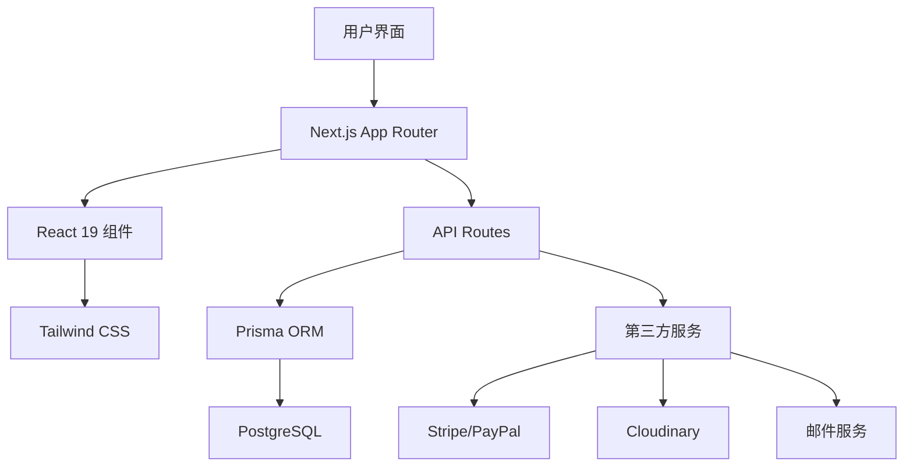

# YOYO Mall - 跨境电商网站完整开发方案


一个功能完整的跨境电商网站开发方案，专为独立站全栈开发工程师设计，支持PC+移动端，具备完整的国际化和支付功能。

## 🌟 特性

- ⚡ **现代技术栈**: Next.js 15 + React 19 + TypeScript
- 📱 **响应式设计**: PC+移动端一套代码，完美适配
- 🌍 **国际化支持**: 多语言、多币种、多时区
- 💳 **多支付方式**: Stripe、PayPal、Apple Pay
- 🛒 **完整电商功能**: 商品管理、订单处理、库存管理
- 🔐 **安全可靠**: 身份认证、数据加密、防攻击
- 🚀 **性能优化**: SSR/SSG、图片优化、代码分割
- 🎨 **现代UI**: Tailwind CSS + shadcn/ui组件
- 📊 **数据分析**: 用户行为、销售统计、性能监控

## 📚 文档目录

### 核心文档
- [📖 跨境电商网站开发指南](./docs/跨境电商网站开发指南.md) - 完整的开发路线图和技术架构
- [🤖 AI协作提示词模板](./docs/AI协作提示词模板.md) - 与AI高效协作的提示词库
- [⚙️ MCP配置与开发规范](./docs/MCP配置与开发规范.md) - 代码规范和质量保证
- [🚀 项目快速启动指南](./docs/项目快速启动指南.md) - 一键启动开发环境

## 🏗️ 技术架构



### 前端技术栈
- **框架**: Next.js 15 (App Router)
- **UI库**: React 19
- **类型系统**: TypeScript 5.0
- **样式方案**: Tailwind CSS + shadcn/ui
- **状态管理**: Zustand
- **表单处理**: React Hook Form + Zod
- **动画库**: Framer Motion
- **国际化**: next-intl

### 后端技术栈
- **API**: Next.js API Routes
- **数据库**: PostgreSQL + Prisma ORM
- **认证**: NextAuth.js
- **支付**: Stripe + PayPal
- **文件存储**: Cloudinary
- **缓存**: Redis (可选)

## 🚀 快速开始

### 1. 克隆项目
```bash
git clone https://github.com/your-username/yoyo-mall.git
cd yoyo-mall
```

### 2. 安装依赖
```bash
npm install
```

### 3. 配置环境变量
```bash
cp .env.example .env.local
# 编辑 .env.local 文件，填入必要的配置
```

### 4. 初始化数据库
```bash
npm run db:generate
npm run db:push
npm run db:seed
```

### 5. 启动开发服务器
```bash
npm run dev
```

访问 [http://localhost:3000](http://localhost:3000) 查看应用。

## 📁 项目结构

```
yoyo-mall/
├── app/                    # Next.js App Router
│   ├── (auth)/            # 认证页面组
│   ├── (shop)/            # 商店前台
│   ├── admin/             # 管理后台
│   └── api/               # API路由
├── components/            # React组件
│   ├── ui/               # 基础UI组件
│   ├── forms/            # 表单组件
│   ├── layout/           # 布局组件
│   └── features/         # 功能组件
├── lib/                  # 工具库
├── hooks/                # 自定义Hooks
├── store/                # 状态管理
├── types/                # TypeScript类型
├── prisma/               # 数据库模式
├── docs/                 # 项目文档
└── public/               # 静态资源
```

## 🛠️ 开发工作流

### 与AI协作的最佳实践

```bash
# 1. 功能开发
"我需要开发商品列表页面，包含搜索、筛选、分页功能，使用Next.js 15和React 19，要求响应式设计"

# 2. 组件创建
"创建一个ProductCard组件，支持商品图片、名称、价格、评分显示，使用TypeScript和Tailwind CSS"

# 3. API开发
"开发商品管理的RESTful API，包含CRUD操作，使用Prisma ORM和Zod验证"

# 4. 性能优化
"优化商品列表页面的性能，包括图片懒加载、虚拟滚动、代码分割"
```

### Git工作流
```bash
# 1. 创建功能分支
git checkout -b feature/product-catalog

# 2. 开发和提交
git add .
git commit -m "feat(product): 添加商品列表和详情页"

# 3. 推送和创建PR
git push origin feature/product-catalog
```

## 📊 功能模块

### 核心功能
- ✅ 用户认证和授权
- ✅ 商品管理系统
- ✅ 购物车和订单处理
- ✅ 多支付方式集成
- ✅ 库存管理
- ✅ 订单追踪

### 高级功能
- ✅ 多语言国际化
- ✅ 多币种支持
- ✅ 优惠券系统
- ✅ 商品评价系统
- ✅ 心愿单功能
- ✅ 管理员后台

### 技术特性
- ✅ 响应式设计
- ✅ SEO优化
- ✅ 性能监控
- ✅ 错误追踪
- ✅ 单元测试
- ✅ 自动化部署

## 💡 AI协作提示词示例

### 基础开发
```
你是一名资深的全栈开发工程师，使用Next.js 15 + React 19 + TypeScript开发跨境电商网站。

要求：
- 严格遵循TypeScript类型安全
- 使用Tailwind CSS进行样式设计
- 代码要有详细的中文注释
- 考虑PC和移动端响应式适配
- 遵循最佳实践和性能优化

请帮我实现[具体功能描述]...
```

### 高级功能
```
需要为电商网站添加[具体功能]，要求：
- 集成Prisma数据库操作
- 使用Zod进行数据验证
- 实现完整的错误处理
- 考虑国际化支持
- 性能优化和用户体验

技术栈：Next.js 15, React 19, TypeScript, Tailwind CSS
```

## 🧪 测试和部署

### 测试命令
```bash
npm run test          # 运行单元测试
npm run test:watch    # 监视模式测试
npm run test:coverage # 测试覆盖率
npm run type-check    # TypeScript类型检查
npm run lint          # 代码规范检查
```

### 部署选项
- **Vercel**: 推荐，零配置部署
- **Netlify**: 静态站点部署
- **AWS**: 企业级解决方案
- **Railway**: 简单易用的平台

## 📈 性能指标

目标性能指标：
- **首次内容绘制 (FCP)**: < 1.5s
- **最大内容绘制 (LCP)**: < 2.5s
- **首次输入延迟 (FID)**: < 100ms
- **累积布局偏移 (CLS)**: < 0.1

## 🤝 贡献指南

1. Fork 项目
2. 创建功能分支 (`git checkout -b feature/AmazingFeature`)
3. 提交更改 (`git commit -m 'Add some AmazingFeature'`)
4. 推送到分支 (`git push origin feature/AmazingFeature`)
5. 打开 Pull Request

## 📄 许可证

本项目采用 MIT 许可证 - 查看 [LICENSE](LICENSE) 文件了解详情

## 🙏 致谢

- [Next.js](https://nextjs.org/) - React全栈框架
- [Tailwind CSS](https://tailwindcss.com/) - CSS框架
- [Prisma](https://prisma.io/) - 数据库工具
- [shadcn/ui](https://ui.shadcn.com/) - 组件库

## 📞 联系方式

- 项目作者: [Your Name]
- 邮箱: your.email@example.com
- 项目链接: [https://github.com/your-username/yoyo-mall](https://github.com/your-username/yoyo-mall)

---

## 项目架构
```
yoyo-mall/                    # 唯一的主项目
├── app/                      # Next.js App Router
│   ├── (shop)/              # 🛍️ 前台商店 (用户购物)
│   │   ├── page.tsx         # 首页
│   │   ├── products/        # 商品列表/详情
│   │   ├── cart/            # 购物车
│   │   └── checkout/        # 结算页面
│   ├── (auth)/              # 🔐 用户认证
│   │   ├── login/           
│   │   └── register/        
│   ├── admin/               # 👨‍💼 管理后台
│   │   ├── dashboard/       # 仪表板
│   │   ├── products/        # 商品管理
│   │   ├── orders/          # 订单管理
│   │   └── users/           # 用户管理
│   └── api/                 # 🔌 后端API接口
│       ├── products/        # 商品API
│       ├── orders/          # 订单API
│       ├── auth/            # 认证API
│       └── payments/        # 支付API
├── components/              # 🧩 共享组件
├── lib/                     # 🛠️ 工具库
├── prisma/                  # 🗄️ 数据库模型
└── ...其他配置文件


第1步：基础架构 (1-2天)
配置 Prisma 数据库模型
创建基础 UI 组件库
设置路由结构
第2步：核心功能 (1-2周)
用户认证系统
商品展示功能
购物车和订单
第3步：管理后台 (1周)
商品管理界面
订单管理功能
用户管理
第4步：高级功能 (1-2周)
支付集成
多语言支持
性能优化
这种架构特别适合：
💼 中小型跨境电商网站
👨‍💻 独立开发者或小团队
🚀 快速上线和迭代的需求
💰 成本控制要求
```

⭐ 如果这个项目对你有帮助，请给它一个星星！

*用AI驱动的跨境电商开发，让独立站建设更简单高效。*
